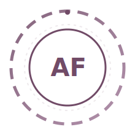
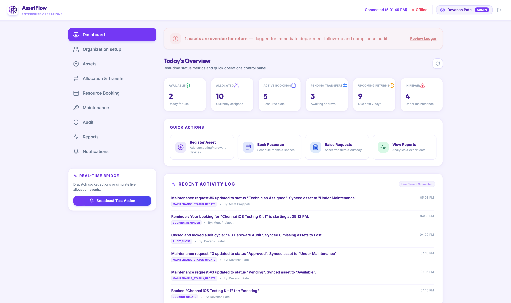
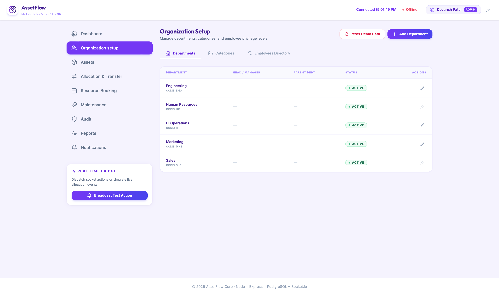
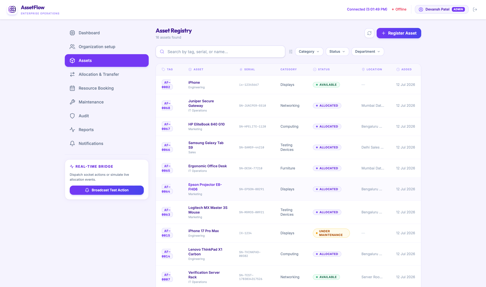
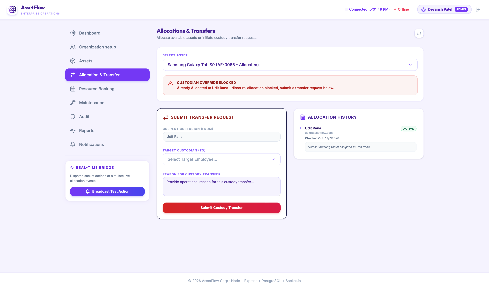
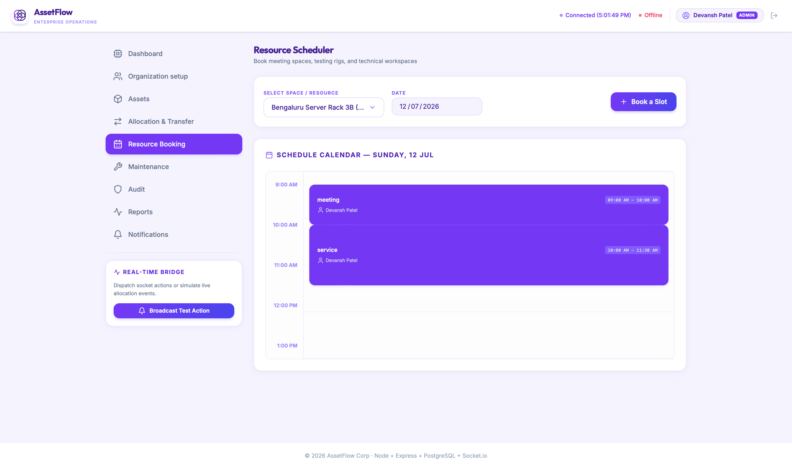
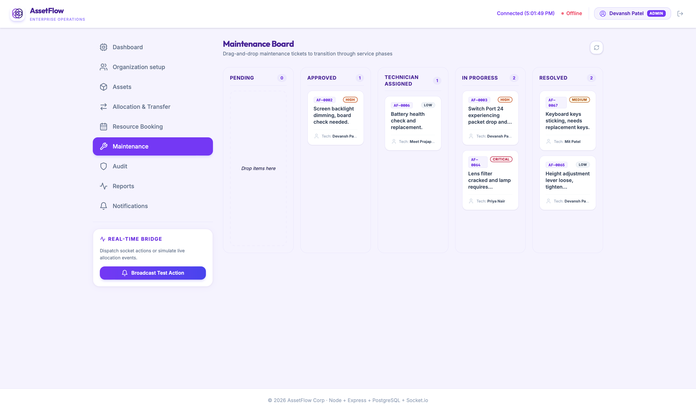
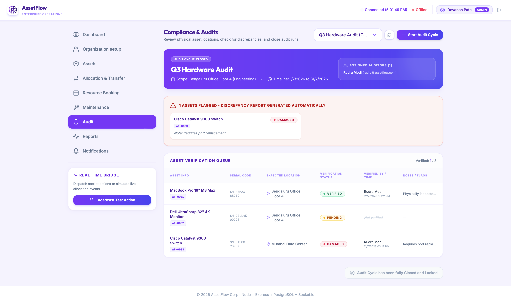
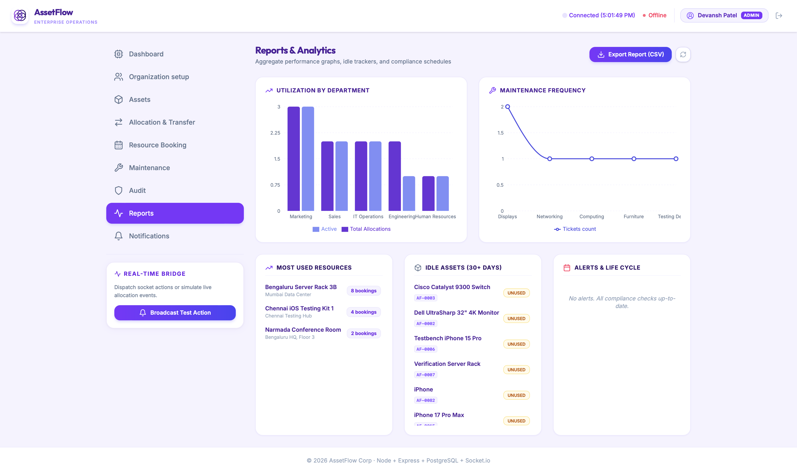
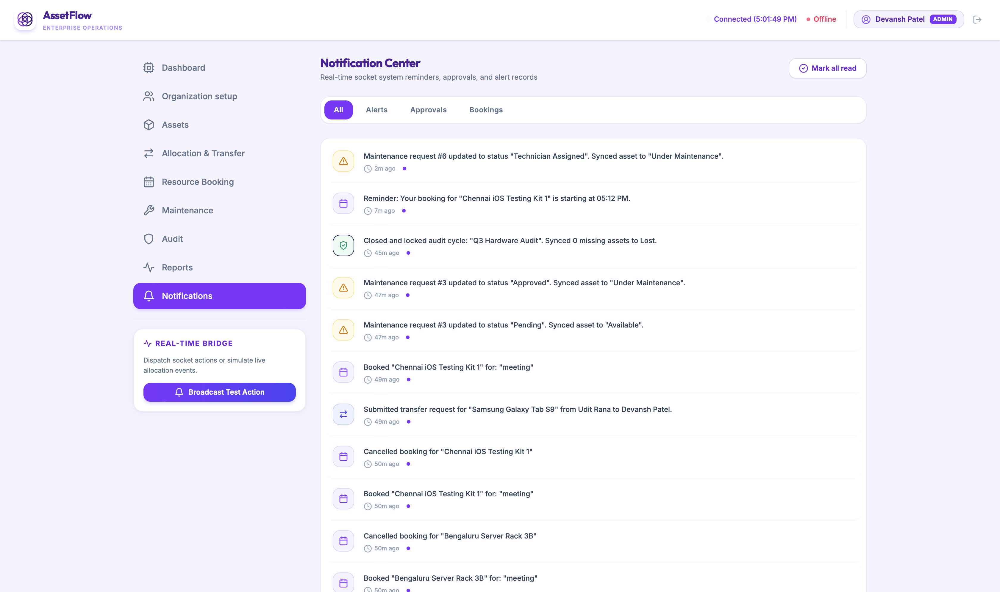

<div align="center">

<br><br>


<br/><br/>
 


 


 
</div>
<br/>
## Table of Contents
 
* [The Story Behind This](#the-story-behind-this)
* [The Actual Problem We're Solving](#the-actual-problem-were-solving)
* [What AssetFlow Does, Screen by Screen](#what-assetflow-does-screen-by-screen)
* [Who Uses This and What They Can Do](#who-uses-this-and-what-they-can-do)
* [The Rules That Actually Make This Work](#the-rules-that-actually-make-this-work)
* [Tech Stack, and Why We Picked Each Piece](#tech-stack-and-why-we-picked-each-piece)
* [How the System is Put Together](#how-the-system-is-put-together)
* [Database, Table by Table](#database-table-by-table)
* [Realtime Layer](#realtime-layer)
* [Folder Structure](#folder-structure)
* [Running This on Your Own Machine](#running-this-on-your-own-machine)
* [Environment Variables](#environment-variables)
* [API, the Short Version](#api-the-short-version)
* [Screens](#screens)
* [Team Codinity](#team-codinity)
* [What We Struggled With](#what-we-struggled-with)
* [What We'd Add With More Time](#what-wed-add-with-more-time)
* [FAQ](#faq)
* [License](#license)
<br/>
## The Story Behind This
 
We walked into the Odoo Hackathon 2026 with the AssetFlow problem statement and honestly, the first read felt deceptively simple. "Track assets, book resources, run maintenance and audits." Sounds like a CRUD app with a nicer name. It's only once you actually sit down and read the fine print in the brief that you realize the whole point isn't the forms, it's the rules sitting behind the forms. An asset can't belong to two people. A room can't be booked twice for the same hour. A repair can't start without approval. That's the actual engineering problem, and that's what we spent most of our 8 hours on.
 
This README is written the same way we'd explain the project out loud to someone walking up to our table at the demo. No corporate language, no filler. Just what we built, why we built it that way, and how to run it.
 
<br/>
## The Actual Problem We're Solving
 
Picture any organization that owns physical stuff. A college has projectors, lab equipment, and classrooms. A hospital has wheelchairs, monitors, and consulting rooms. A factory has forklifts, tools, and loading bays. An office has laptops, chairs, and meeting rooms.
 
Right now, almost all of them track this the same broken way. A shared spreadsheet that three people are editing at once. A WhatsApp group where someone types "does anyone know where the projector went." A paper logbook nobody actually fills in consistently. None of it is real time, none of it prevents mistakes, and by the time someone notices an asset is missing, it's been missing for months.
 
The Odoo brief asked us to build a proper ERP module for this, specifically excluding purchasing, invoicing, and accounting so the scope stays focused on the actual lifecycle of an asset: get registered, get allocated, get used, get maintained, get audited, eventually get retired. AssetFlow is our implementation of that lifecycle, with the enforcement rules built directly into the backend, not just suggested in the UI.
 
<br/>
## What AssetFlow Does, Screen by Screen
 
### 1. Login and Signup
 
Signing up through the public form only ever creates a plain Employee account. There's no role dropdown, no "register as Admin" option anywhere. This was a specific requirement in the brief and it matters more than it looks like at first: it means nobody can self-elevate their own permissions just by filling out a form differently. Every account starts at the bottom, and gets promoted deliberately by someone who already has authority.
 
Email and password login, a forgot password flow, and session validation through a JWT token round out this screen.
 
### 2. Dashboard
 
The first thing anyone sees after logging in. Six KPI cards up top: Assets Available, Assets Allocated, Maintenance Today, Active Bookings, Pending Transfers, Upcoming Returns. Below that, anything overdue, meaning any allocation past its expected return date, gets pulled out into its own red banner instead of getting buried in the numbers, because the whole point of a dashboard is that the urgent stuff shouldn't require digging.
 
There are three quick action buttons: Register Asset, Book Resource, Raise Maintenance Request, so the three most common actions in the whole app are always one click away, no matter which screen you were previously on.
 
A recent activity feed sits at the bottom and updates live, since we wired it into the same Socket.io layer that powers notifications elsewhere.
 
### 3. Organization Setup, Admin Only
 
This is the master data screen, split into three tabs, and everything else in the app depends on what's set up here.
 
Tab A, Department Management, is where departments get created, edited, or deactivated, with an assigned Department Head and an optional parent department for cases where departments are nested under a bigger division.
 
Tab B, Asset Category Management, is where categories like Electronics, Furniture, or Vehicles get created, each with optional category-specific fields, for example a warranty period field that only makes sense for Electronics.
 
Tab C, Employee Directory, lists every employee with their department, role, and status, and this is the only screen in the entire application where an Admin can promote someone to Department Head or Asset Manager. We were deliberate about keeping role assignment centralized to exactly one place, because scattering that ability across multiple screens is how permission bugs happen.
 
### 4. Asset Registration and Directory
 
Where every physical asset gets entered into the system: name, category, an auto-generated asset tag like AF-0001, serial number, acquisition date, acquisition cost, condition, location, and an optional photo. Acquisition cost is kept purely for reporting and ranking purposes since accounting was explicitly out of scope.
 
There's a "shared or bookable" flag on each asset, since some assets, like a projector, might be booked by time slot rather than allocated to one person long term.
 
Search works across tag, serial number, QR code, category, status, department, and location, and every asset carries a visible lifecycle status: Available, Allocated, Reserved, Under Maintenance, Lost, Retired, or Disposed. Clicking into an asset shows its full history, both allocation history and maintenance history, in one place.
 
### 5. Asset Allocation and Transfer
 
This is where an asset gets assigned to an employee or department, with an optional expected return date. The core rule here, and the one we're proudest of, is the conflict check: you cannot allocate an asset that's already taken.
 
If Priya already has Laptop AF-0114 and Raj tries to allocate the same laptop to himself, the system stops it immediately, tells Raj it's currently held by Priya, and offers a Transfer Request button instead of letting the record get silently overwritten. The transfer then has to move through Requested, then Approved by an Asset Manager or Department Head, then Reallocated, with the allocation history updating automatically at each step.
 
Returning an asset captures a condition check-in note and flips the asset's status back to Available. Overdue allocations, meaning anything past its expected return date, get auto-flagged and feed straight into the Dashboard and the Notifications screen.
 
### 6. Resource Booking
 
Time-slot booking for shared resources like meeting rooms, vehicles, or shared equipment. The screen shows a calendar view of a resource's existing bookings, and the overlap validation happens the same way the allocation conflict check does, at the database query level, not just in the interface.
 
If Room B2 is booked 9 to 10, a request for 9:30 to 10:30 gets rejected because it overlaps. A request for 10 to 11 goes through fine because it starts exactly when the previous booking ends. Bookings carry a status, Upcoming, Ongoing, Completed, or Cancelled, and can be cancelled or rescheduled, with a reminder notification firing before the slot starts.
 
### 7. Maintenance Management
 
Built as a kanban board because that's genuinely the clearest way to represent an approval pipeline. Someone raises a request by selecting the asset, describing the issue, setting a priority, and optionally attaching a photo. From there it moves through Pending, then Approved or Rejected by an Asset Manager, then Technician Assigned, then In Progress, then Resolved.
 
The asset's own status updates automatically at two points in this pipeline: it flips to Under Maintenance the moment the request is approved, and flips back to Available the moment the request is marked Resolved. Nobody has to remember to manually change the asset's status, the workflow does it.
 
### 8. Asset Audit
 
Instead of a single ad hoc checklist, audits are run as scheduled cycles. An Admin or Asset Manager creates an audit cycle with a scope, either a department or a location, and a date range, then assigns one or more auditors to it. Each auditor goes through their assigned assets and marks each one Verified, Missing, or Damaged.
 
The system automatically generates a discrepancy report for anything flagged, so nobody has to manually compile a list of what went wrong. Closing the audit cycle locks it permanently and updates affected asset statuses, so anything confirmed missing gets marked Lost. Every past audit cycle stays in the history for reference.
 
### 9. Reports and Analytics
 
The screen managers actually care about. Asset utilization trends broken down by department, maintenance frequency by asset and category, a list of assets due for maintenance or nearing retirement, a department wise allocation summary, and a booking heatmap showing peak usage windows for shared resources. Everything here is exportable, so it can actually be pulled into a real report instead of staying trapped in the app.
 
### 10. Activity Logs and Notifications
 
Every meaningful action in the system, an asset getting assigned, a maintenance request getting approved or rejected, a booking getting confirmed, cancelled, or reminded, a transfer getting approved, an overdue return, an audit discrepancy getting flagged, generates a notification. This screen shows the full feed, filterable by type, and updates live thanks to Socket.io, alongside a complete activity log of who did what and when, for full traceability.
 
<br/>
## Who Uses This and What They Can Do
 
| Role | What They Can Do |
|---|---|
| **Admin** | Manages departments, categories, audit cycles, and employee role assignment. Views organization wide analytics across every department. |
| **Asset Manager** | Registers and allocates assets. Approves transfers, maintenance requests, and audit discrepancy resolution. Approves returns and condition check in notes. |
| **Department Head** | Views assets allocated to their own department. Approves allocation and transfer requests within their department. Books shared resources on behalf of the department. |
| **Employee** | Views assets allocated to them personally. Books shared resources. Raises maintenance requests. Initiates return or transfer requests. |
 
<br/>
## The Rules That Actually Make This Work
 
A few of the business rules deserved more explanation than a bullet point, so here they are in full.
 
**Nobody self-promotes.** Signing up creates an Employee account, full stop. Every elevated role, Department Head or Asset Manager, gets assigned deliberately by an Admin from the Employee Directory in Organization Setup. This is checked server side on every protected route, not just hidden in the UI.
 
**One asset, one holder, at a time.** Before any allocation is created, the backend checks the asset's current status. If it's already Allocated, the request gets rejected with a 409 response and the current holder's name, and the client swaps the allocate button for a transfer request form. This is the same logic that stops a room from being double booked, checked against overlapping time ranges at the database query level.
 
**Maintenance status drives asset status.** An asset never manually flips to Under Maintenance, it happens automatically the instant a maintenance request tied to it gets approved, and reverses automatically the instant that request gets resolved. This keeps the asset's status trustworthy without relying on someone remembering to update it by hand.
 
**Closing an audit is permanent and consequential.** Once an audit cycle is closed, it locks, no further edits, and any asset marked Missing during that cycle gets its status changed to Lost as part of the same operation, not as a separate manual step someone has to remember.
 
<br/>
## Tech Stack, and Why We Picked Each Piece
 
| Layer | Choice | Reasoning |
|---|---|---|
| Frontend | React + Vite + TailwindCSS | Vite's dev server starts instantly, which matters a lot when you only have 8 hours and can't afford to wait on rebuilds. Tailwind let us match Odoo's purple and white theme precisely without writing custom CSS files for every screen. |
| Backend | Node.js + Express | Every team member already knew this stack well, and in a timed hackathon, familiarity beats novelty. Express kept the route structure simple to reason about across four people working in parallel. |
| Database | PostgreSQL | The data here is genuinely relational, departments contain employees, employees hold assets, assets have allocation and maintenance histories, and audits reference all of it. A relational database with real foreign keys was the honest choice, not a NoSQL shortcut that would've caused problems later. |
| Realtime | Socket.io | Bookings, maintenance kanban movement, and notifications all needed to update across multiple logged in users without a page refresh. Socket.io handled this without needing a separate message queue setup. |
| Auth | JWT + bcrypt | Stateless authentication meant no server side session store to configure and maintain under time pressure, and bcrypt is still the standard for password hashing done properly. |
 
We deliberately left out an ORM. Every table is created and queried with plain SQL. It's a few more lines of code in the routes, but it's dramatically easier to explain to a judge in ninety seconds, and none of us wanted to debug an ORM migration issue at three in the morning mid hackathon.
 
<br/>
## How the System is Put Together
 
```
Browser (React + Vite)
        |
        |  REST calls (JWT in Authorization header)
        |  Socket.io connection (live events)
        v
Express Server
        |
        |-- Auth routes (signup, login, session check)
        |-- Organization routes (departments, categories, employees)
        |-- Asset routes (register, search, allocate, transfer, return)
        |-- Booking routes (create, cancel, overlap check)
        |-- Maintenance routes (raise, approve, assign, resolve)
        |-- Audit routes (create cycle, mark items, close cycle)
        |-- Reports routes (aggregation queries)
        |-- Notification routes + Socket.io event emitters
        v
PostgreSQL (auto migrated schema, auto seeded demo data on first run)
```
 
Every write to the database that matters to another user, a new booking, a maintenance card moving columns, a transfer getting approved, also triggers a Socket.io event, so anyone else looking at a relevant screen sees it update without refreshing.
 
<br/>
## Database, Table by Table
 
| Table | What It Holds |
|---|---|
| `departments` | Name, head, optional parent department, active status |
| `categories` | Asset categories with optional category specific fields stored as JSON |
| `employees` | Name, email, password hash, department, role, status |
| `assets` | Tag, name, category, serial number, acquisition details, condition, location, bookable flag, current lifecycle status |
| `allocations` | Which employee or department currently holds which asset, expected return date, return condition notes |
| `transfers` | Requested, approved, and reallocated state for moving an asset between holders |
| `resources` | Bookable resources like rooms, vehicles, and equipment |
| `bookings` | Resource, booker, start and end time, status |
| `maintenance_requests` | Asset, issue description, priority, current pipeline stage, assigned technician |
| `audit_cycles` | Scope, date range, status, assigned auditors |
| `audit_items` | Individual asset verification result within a cycle |
| `activity_log` | Every meaningful action across the system, with who did it and when |
| `notifications` | Feed entries tied to the events above, read or unread |
 
The schema builds itself the first time the server starts, using `CREATE TABLE IF NOT EXISTS` for every table above, and seeds a small set of demo departments, categories, employees, and assets if the database is empty, so a fresh clone is never sitting there with zero data to demo against.
 
<br/>
## Realtime Layer
 
Socket.io runs alongside the Express server and handles the events that genuinely need to be instant rather than waiting on a page refresh.
 
| Event | Fired When |
|---|---|
| `booking:created` | A new resource booking is confirmed |
| `booking:cancelled` | An existing booking is cancelled |
| `maintenance:status-changed` | A maintenance card moves to a new kanban column |
| `notification:new` | Any action that generates a notification, allocation, approval, overdue flag, audit discrepancy |
| `dashboard:activity` | Feeds the live Recent Activity list on the dashboard |
 
<br/>
## Folder Structure
 
```
assetflow/
  client/
    src/
      pages/          one folder per screen: Dashboard, Assets, Booking, Maintenance, Audit, Reports...
      components/     shared UI pieces, buttons, cards, status pills
      context/         auth context, socket context
      api/              axios calls grouped by module
  server/
    db/
      schema.sql        every table, CREATE TABLE IF NOT EXISTS
      seed.sql           demo departments, categories, employees, assets
      init.js             runs schema and seed automatically on server start
    routes/
    controllers/
    sockets/              booking, maintenance, and notification event emitters
  assets/
    logo-animated.svg      the animated logo at the top of this file
  .env.example
  README.md
```
 
<br/>
## Running This on Your Own Machine
 
You do not need to open pgAdmin or write any SQL by hand. Clone it, point it at a Postgres database, run the server, and the schema plus demo data build themselves.
 
```bash
git clone https://github.com/PDA-DP-Shop/assetflow.git
cd assetflow
 
cd server
npm install
cp .env.example .env
npm run dev
```
 
Watch the terminal, you should see the schema get created and demo data get seeded automatically. Then in a second terminal:
 
```bash
cd client
npm install
npm run dev
```
 
Open `http://localhost:5173`, log in with the demo admin account listed in `seed.sql`, and every screen is already populated with realistic data, no empty states to explain around during a demo.
 
<br/>
## Environment Variables
 
| Variable | Description |
|---|---|
| `DATABASE_URL` | Full PostgreSQL connection string |
| `JWT_SECRET` | Secret used to sign and verify auth tokens |
| `PORT` | Port the Express server runs on |
| `CLIENT_URL` | Frontend origin, used for CORS and Socket.io configuration |
 
<br/>
## API, the Short Version
 
| Method | Endpoint | Purpose |
|---|---|---|
| POST | `/api/auth/signup` | Create an Employee account |
| POST | `/api/auth/login` | Log in, returns a JWT |
| GET | `/api/dashboard/summary` | KPI numbers for the dashboard |
| GET | `/api/assets` | List and filter assets |
| POST | `/api/assets` | Register a new asset |
| POST | `/api/allocations` | Allocate an asset, blocked if already held |
| POST | `/api/allocations/:id/return` | Return an asset with condition notes |
| POST | `/api/bookings` | Book a resource, blocked if overlapping |
| POST | `/api/maintenance-requests` | Raise a maintenance request |
| PATCH | `/api/maintenance-requests/:id/status` | Move a request through the approval pipeline |
| POST | `/api/audits` | Create an audit cycle |
| PATCH | `/api/audits/:id/close` | Lock a cycle and update missing asset statuses |
| GET | `/api/reports/utilization` | Department wise utilization data |
 
<br/>
## Screens
 
Every image below opens full size on click, GitHub does this automatically for any image wrapped in a link. Drop your actual screenshots into a `screenshots/` folder in the repo root using the file names below, and this grid fills itself in, no markdown changes needed.
 
<table>
<tr>
<td width="33%" align="center">
<a href="./screenshots/login.png"></a>
<br/><sub><b>Login & Signup</b></sub>
</td>
<td width="33%" align="center">
<a href="./screenshots/dashboard.png"></a>
<br/><sub><b>Dashboard</b></sub>
</td>
<td width="33%" align="center">
<a href="./screenshots/organization-setup.png"></a>
<br/><sub><b>Organization Setup</b></sub>
</td>
</tr>
<tr>
<td width="33%" align="center">
<a href="./screenshots/asset-registry.png"></a>
<br/><sub><b>Asset Registry</b></sub>
</td>
<td width="33%" align="center">
<a href="./screenshots/allocation-transfer.png"></a>
<br/><sub><b>Allocation & Transfer</b></sub>
</td>
<td width="33%" align="center">
<a href="./screenshots/resource-booking.png"></a>
<br/><sub><b>Resource Booking</b></sub>
</td>
</tr>
<tr>
<td width="33%" align="center">
<a href="./screenshots/maintenance.png"></a>
<br/><sub><b>Maintenance Kanban</b></sub>
</td>
<td width="33%" align="center">
<a href="./screenshots/audit.png"></a>
<br/><sub><b>Asset Audit</b></sub>
</td>
<td width="33%" align="center">
<a href="./screenshots/reports.png"></a>
<br/><sub><b>Reports & Analytics</b></sub>
</td>
</tr>
<tr>
<td width="33%" align="center">
<a href="./screenshots/notifications.png"></a>
<br/><sub><b>Activity Logs & Notifications</b></sub>
</td>
<td width="33%"></td>
<td width="33%"></td>
</tr>
</table>
Every screen shares the same visual language, Odoo's purple at `#714B67` used for accents, headers, and primary buttons, white everywhere else, and status shown as colored pills rather than buried in plain text.
 
<br/>

## Team Codinity

| | Name | What They Built |
|---|---|---|
| 🧭 | **[Devansh](https://github.com/your-github-username)** | Lead. Authentication, dashboard, organization setup, and final integration across every module |
| 🧩 | **[Rudra Modi](https://github.com/rudra-github-username)** | Asset registration and directory, allocation and transfer, including the double allocation block |
| ⏱️ | **[Udit Rana](https://github.com/udit-github-username)** | Resource booking with overlap validation, maintenance kanban, and the Socket.io realtime layer |
| 📋 | **[Mit Prajapati](https://github.com/mit-github-username)** | Audit cycles, reports and analytics, and the activity log and notifications screen |

<br/>

## What We Struggled With
 
Being straightforward about this instead of pretending the whole thing went smoothly. The booking overlap check took longer than expected to get right, our first version only checked if the new start time fell inside an existing booking, which missed cases where the new booking fully surrounded an old one. Rewriting it as a proper range overlap comparison fixed it.
 
The maintenance kanban's drag and drop also ate more time than planned since we used native HTML5 drag events instead of a library, which is lighter but needed more manual handling for the visual feedback while dragging.
 
<br/>
## What We'd Add With More Time
 
QR code scanning for asset check in and check out instead of manual search. Email notifications alongside the in app ones. Properly hiding UI elements based on role rather than only guarding routes. A real mobile responsive pass, since this was built desktop first for the demo. Bulk asset import from a spreadsheet for onboarding an organization's existing inventory in one go.
 
<br/>
## FAQ
 
**Does this touch purchasing or accounting at all?**
No, that was explicitly out of scope in the brief. Acquisition cost is stored purely for reporting and ranking, it's not connected to any accounting logic.
 
**Can an employee promote themselves to Admin?**
No. Signup only ever creates a plain Employee account, and role promotion only happens from the Employee Directory in Organization Setup, by someone who is already an Admin.
 
**What happens if two people try to book the same room at the exact same time?**
Whichever request reaches the server first gets the slot, the second request is rejected with a clear message explaining the conflict, checked at the database level, not just in the interface.
 
**Does the database need to be set up manually?**
No. The schema and demo data build themselves automatically the first time the server starts.
 
<br/>
## License
 
MIT. Built for the Odoo Hackathon 2026, use whatever's useful out of it.
 
<br/>
<div align="center">

<br/>
<sub>Built with more coffee than sleep by Team Codinity</sub>
</div>
 
